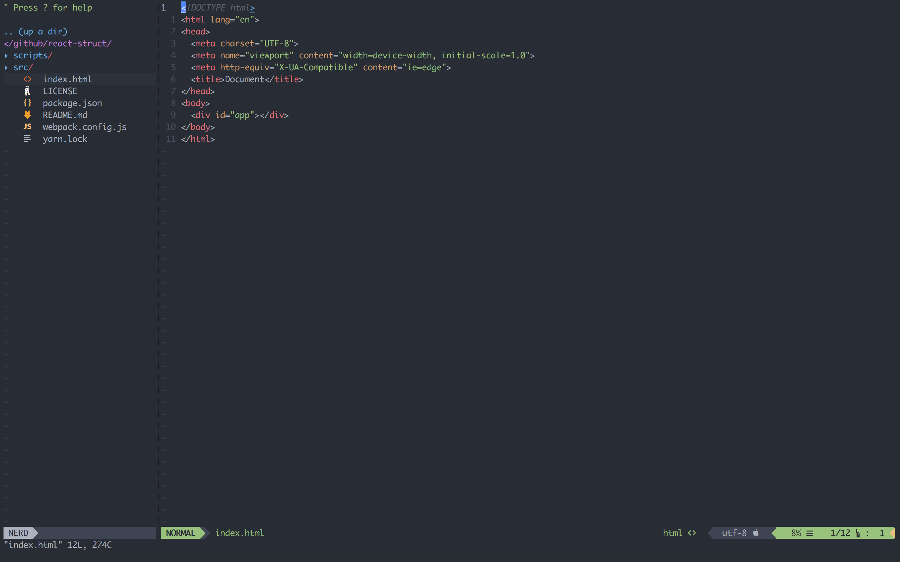
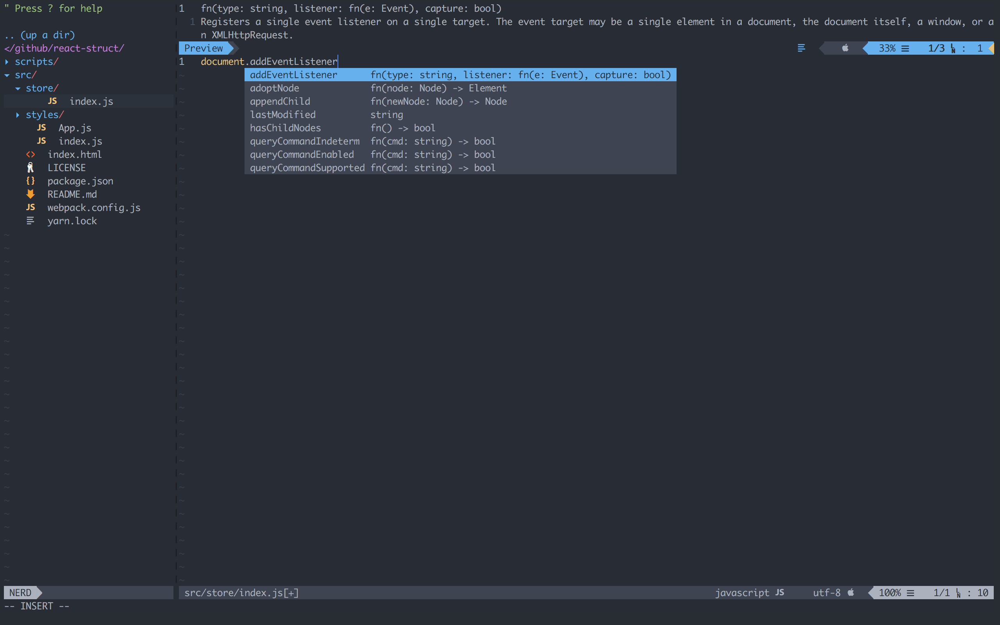

# Ren Chunhui's Dotfiles 

[]()


## 安装

``` bash
$ git clone https://github.com/RenChunhui/dotfiles.git .dotfiles
$ cd .dotfiles
$ chmod +x ./install.sh
$ ./install.sh	
```

## Vim & NeoVim 安装

**插件YouCompleteMe所需的Python已在初使化环境中配置完成**

> 适合前端 Vue、React.js、Typescript 相关开发，

``` bash
$ cd ~/.config/nvim/plugged/YouCompleteMe
$ ./install.py --js-completer
```

NeoVim



YouCompleteMe



## macOS 设置

``` bash
$ cd scripts
$ chmod +x ./osx.sh
$ ./osx.sh
```

## 参考
- [Nick Plekhanov's Dotfiles](https://github.com/nicksp/dotfiles.git)

## 许可证

[MIT license](LICENSE).
